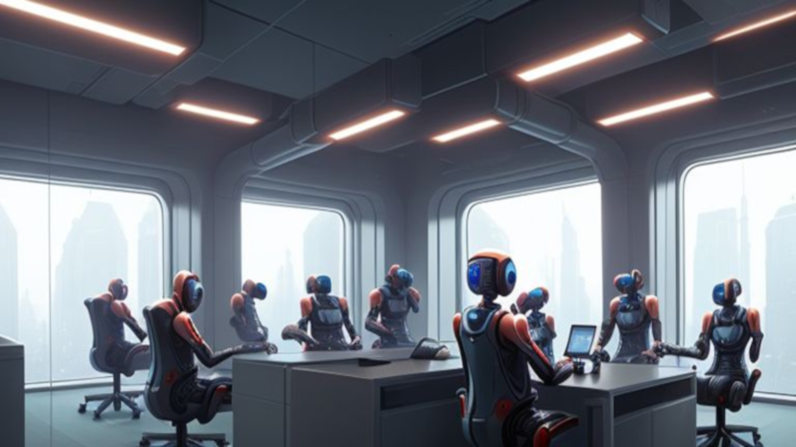
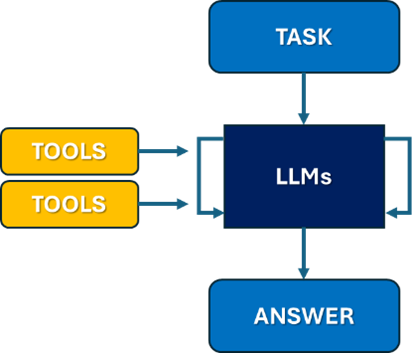
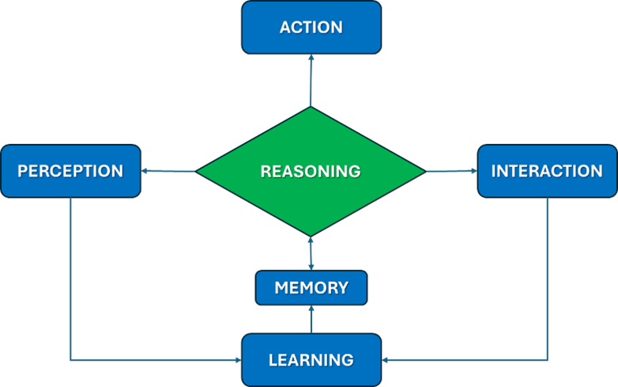
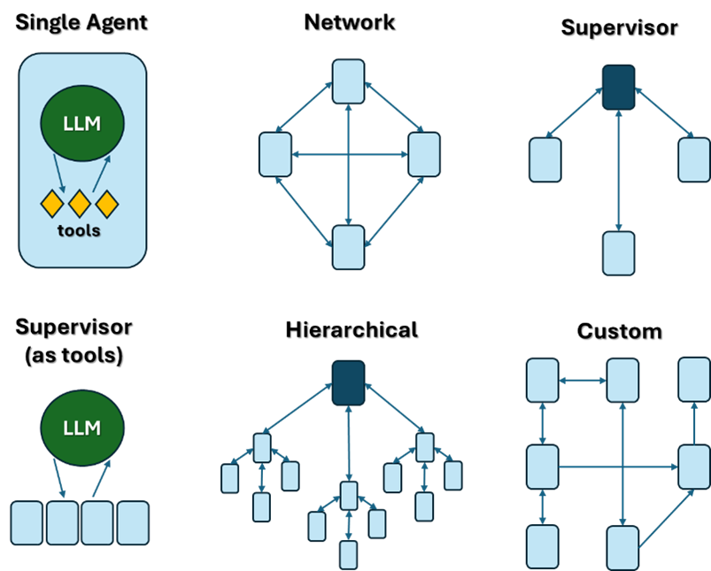

# An Introduction to Multi-AI Agent Systems  

Artificial Intelligence is evolving rapidly, and one of its most exciting advancements is Multi-AI Agent Systems. These systems enable multiple AI Agents to collaborate to achieve complex objectives. I found this to be one of the most fascinating recent developments in the field. This fundamentally changes how machines interact with the world and plays a crucial role in AI's future progress.  

In this article, I provide an overview of Multi-AI Agent Systems covering their core concepts, architectures, and applications to help you understand the field and take your first steps into it.  

## AI Agents  

An **AI Agent** is an autonomous entity that perceives its environment and executes tasks (making decisions and taking actions) to achieve a specific goal. AI agents can be **reactive** (responding to inputs) or **proactive** (planning ahead based on objectives).  

They typically follow a circular iterative process, leveraging Large Language Models (LLMs) and other tools to perceive their environment, research and reason, generate an output, and continuously refine their approach until they produce a satisfactory answer for the given task.  

### **Key Components of an AI Agent:**  

- **Perception** – The ability to perceive the environment through sensors, APIs, or data inputs.  
- **Reasoning** – The process of analyzing information and making decisions using algorithms or models.  
- **Action** – The execution of tasks or responses based on decisions.  
- **Learning** – The capability to improve performance over time by processing data and experience.  
- **Interaction** – The ability to communicate with users or external systems to receive instructions, provide feedback, or adapt to changing conditions.

### **Main Elements of AI Agents:**  

- **Role Definition** – The specific context and responsibilities assigned to the agent.  
- **Focus** – The goal or objective the agent is designed to achieve.  
- **Tools** – External resources or APIs the agent can use to complete tasks effectively.  
- **Collaboration** – The ability to take feedback, delegate tasks, and, in multi-agent settings, coordinate with other agents.  
- **Guardrails** – Constraints to prevent issues like hallucinations, infinite loops, or excessive processing time.  
- **Memory** – The capacity to retain and recall past interactions for improved decision-making.  
  - **Short-term memory** – Retains information within a session to enhance task continuity.  
  - **Long-term memory** – Stores knowledge from past executions to enable self-improvement.  
  - **Entity memory** – Tracks specific discussion topics for short-lived relevance.  

## Multi AI Agents  

Multi AI Agent Workflows can break down complex tasks into subtasks that can be executed by agents with well-defined roles. Multiple AI Agents collaborate within the same environment to solve problems that are too complex for a single agent.  

### **Agent Interactions:**  
- **Cooperative** – Agents work together towards a common goal, sharing information and resources.  
- **Competitive** – Agents compete against each other to achieve their individual goals, potentially leading to more innovative solutions.  

These independent agents can be as simple as a prompt and an LLM call, or as complex as a **Reasoning and Action (ReAct) agent**.  

### **Primary Benefits of Multi-Agent Systems:**  
- **Modularity** – Separate agents make it easier to develop, test, and maintain agentic systems.  
- **Specialization** – You can create expert agents focused on specific domains, which helps with overall system performance.  
- **Control** – You can explicitly control how agents communicate (as opposed to relying on function calling).  

## Multi-Agent Architectures  

There are several ways to connect agents in a multi-agent system:  

- **Network** – Each agent can communicate freely with any other agent and choose whom to call next.  
- **Supervisor** – A central supervisor agent directs communication, deciding which agent to call next.  
- **Supervisor (as tools)** – A specialized supervisor architecture where agents function as tools. The supervisor, using a tool-calling LLM, selects which agent tools to call and what arguments to pass.  
- **Hierarchical** – A multi-level supervisor system, where supervisors oversee other supervisors, enabling complex control flows.  
- **Custom workflow** – Agents communicate only within defined subsets. Some interactions follow a set flow, while certain agents can decide the next call.  

Many authors and content creators use metaphors and analogies to explain Multi-Agent AI Systems. Some compare them to **living organisms**, where collaborative cells perform specialized functions to achieve overall efficiency. Others describe them as **corporate departments**, each responsible for specific tasks such as financial analysis, customer service, or internal policy management. These analogies help simplify complex AI concepts, making it easier to understand how multiple agents collaborate to achieve intelligent and efficient outcomes.  

## Application Examples  

The practical applications of Multi AI Agent Systems span various industries:  

- **Supply Chains** – Optimize logistics, inventory management, and demand forecasting.  
- **Autonomous Vehicles** – Coordinate to enhance traffic management and vehicle safety.  
- **Finance** – Improve trading strategies, fraud detection, and risk management.

**In this repository I am including some more practical examples.**

## Popular Tools for Multi AI Agent Systems  

Several tools and platforms are commonly used to develop and manage Multi AI Agent Systems:  

- **crewAI** – An open-source framework for building collaborative AI agent systems, enabling role-based coordination and external tool integration.  
- **LangGraph** – An open-source AI agent framework designed to build, deploy, and manage complex generative AI agent workflows.  
- **OpenAI Swarm** – A platform that enables developers to build and manage multi-agent systems, facilitating complex AI-driven workflows.  
- **n8n** – An open-source workflow automation tool that enables users to connect applications, APIs, and databases to automate tasks. It provides a Graphical User Interface for building workflows with no-code and low-code options.  

## To Learn More  

For those interested in learning more, the following resources offer valuable insights into the design, implementation, and applications of multi-agent AI systems:  

- **[Multi AI Agent Systems with crewAI – DeepLearning.AI](https://www.deeplearning.ai/short-courses/multi-ai-agent-systems-with-crewai/)**  
- **[LangGraph: Multi-Agent Concepts](https://langchain-ai.github.io/langgraph/concepts/multi_agent/)**  
- **[Sandgarden: Multi-Agent AI Guide](https://www.sandgarden.com/learn/multi-agent-ai)**  
- **[Multi-Agent Systems with AutoGen: Tools and Startups](https://multiagentbook.com/labs/tools/)**  

## Closing Thoughts  

AI is evolving fast, and Multi-AI Agent Systems are proving to be a game-changer across industries. From optimizing supply chains to powering autonomous vehicles and financial systems, these agents are making problem-solving smarter and more efficient. However, as we integrate AI into more aspects of our lives, ensuring ethical usage is crucial—designing systems that are transparent, fair, and aligned with human values.  

The way we work is also shifting. AI Agents won’t just automate tasks; they’ll collaborate with us, enhancing human decision-making and allowing us to focus on creativity, strategy, and higher-level problem-solving. Understanding and leveraging these technologies will be a key skill, and there’s never been a better moment to dive in, experiment, and see what’s possible. Hopefully, the resources here will help you get started and spark some ideas on how you might use Multi AI Agent Systems in your own projects.  

## About Me  

I am a **Senior Data Scientist** with global experience in AI, analytics, and business transformation. Passionate about leveraging AI to solve complex challenges, I have led many projects across major enterprises in Latin America and Europe. Currently, I’m exploring the impact of Multi-Agent AI Systems and their potential to reshape industries.  

I’m always open to discussions, collaborations, and exchanging insights — **let’s connect!**  
